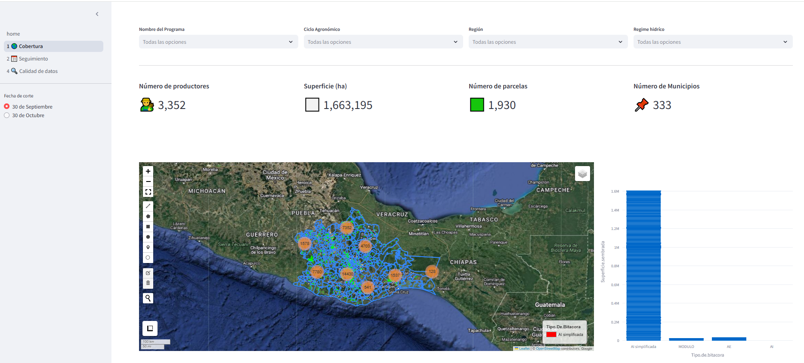

## Intro
This dashboard represents the latest version implemented in the second half of 2024.

It completely changes the infrastructure, as it is now a web application (unlike the static pages previously hosted in S3 buckets).



### Data Sources

The data is sourced from `.csv` and `.geojson` files, based on pre-agreed dates. While this is not considered a best practice, the scope of this app is limited by the lack of external services for data consumption, such as a query API.

However, this presents an opportunity for improvement and future development (CI/CD) to build an ecosystem in conjunction with tools for processing and transforming datasets.

### Recommendations for Working with This Version

Given these considerations, for this version, it is recommended to have strong knowledge in:

- **Python 3** and its ecosystem.
- **Data structures** and **Object-Oriented Programming (OOP)**.
- **Cloud computing** concepts.
- **Set theory** (relations and cardinality) as applied to web development.

Additionally, an intermediate level of proficiency in the following libraries is essential:

- `pandas`, `numpy`, `geopandas`, and `plotly` for data manipulation and visualization.

- `streamlit` framework to build web app based in python3.
 
Familiarity with **Linux-based operating systems** is also highly recommended. 

### Additional Skills

A background in **geographic information systems (GIS)**, **agronomy**, or **statistics** will be a significant advantage for interpreting results and maximizing the application's potential.


### Requirements

1. Datasets (CSV files)
2. Repository
3. Access to AWS EC2 (root user)

### Roadmap

1. Clone the repository (link provided in the Excel file).
2. Process data using Jupyter Notebook.
3. Add paths for the new datasets.
4. Stop the application before the update.
5. Upload the files to the EC2 instance.
6. Deploy the application.

### Additional Notes

While this documentation does not cover setting up a Python development environment, there are many tutorials online that explain how to create, install libraries, activate, and deactivate a virtual environment in Python 3. 

For a quick start, you can refer to [Mohan (2024)](https://medium.com/@KiranMohan27/how-to-create-a-virtual-environment-in-python-be4069ad1efa), which provides a basic guide to get a Python project up and running.

#### Data Processing

Each dataset has a corresponding Jupyter Notebook file located in the `/tools` directory, which is used for data processing. It is crucial to review the structure, encoding, content, and column names of each file. If these elements do not meet the expected format, the script will not work correctly. 

This is one of the key advantages of using Jupyter Notebook—it provides visibility into the output of each cell, making it easier to debug and validate data processing steps.

#### Update App

Once the datasets are formatted correctly and their paths have been declared in the `.py` files, the changes need to be saved. In this project, datasets are not stored in Git (as this is not a best practice). Instead, they are kept locally and on the server. 

To upload `.csv` and `.geojson` files, use tools like [PuTTY](https://www.putty.org/) or [FTP](https://en.wikipedia.org/wiki/File_Transfer_Protocol), depending on the configuration of your development environment.

If you need access to passwords or `.pem` key files, please contact the AWS administrator or refer to the delivery Excel file, which contains details about passwords and key files.

**All datasets are stored in the `/data` directory.**

```
sefader
    ├── data/ 
    │    └── dataset.csv
    │
    └── pages
           └── section.py

```
It is highly recommended to stop the server before executing changes using the `git pull` command.

#### Stop the Application

> **Note:** The application directory is located in the home path:<br> 
> `root@ip-172-31-9-47:/home/ubuntu/sefader#`

For this step, you need to identify the application's `id`. Log in as root and execute the following command:

```bash
ps -ef
```
This will return a list of running processes. Locate the application's ID and then execute the kill command followed by the ID.

```bash
kill idnumber # example, id is an integer

```
Please exercise caution during this step.

Once completed, you can safely edit or add files in the application directory without needing to restart the entire server.

#### Deploying

After applying the following changes:

1. Adding new datasets.
2. Referencing these datasets in the corresponding Python files.
3. Validating functionality in the local environment.

It is necessary to restart the application.

For this step, you should use [nohup](https://www.digitalocean.com/community/tutorials/nohup-command-in-linux), which ensures the application continues running even after you log out.

In addition, you need to specify the language and main library being used. For this application, the primary library is `streamlit`. You are encouraged to read the [Streamlit documentation](https://streamlit.io/components). 

Finally, you must specify the main file and declare the output port. By default, `streamlit` uses a port that is different from the conventional ones typically used for web applications.

```bash

 nohup python3 -m streamlit run home.py --server.port 80

```
> Remember to execute the commands as the root user and ensure you are in the correct path.

#### Recommendations and Maintenance

##### Maintenance

`Streamlit` relies heavily on caching. However, it is recommended to implement directory cleanup processes and remove unnecessary files. This is especially important given that the server hosting the app is a t2.medium instance with an 8GB disk size (less than 500MB free).

##### Recommendations

- Add a domain.
- Implement a login system.

For login functionality, `Streamlit` offers community-created extensions, one of which enables adding a login system. 

This app is intended for the public sector, and due to limited memory and computational resources, no additional components have been installed that could potentially impact its performance.


