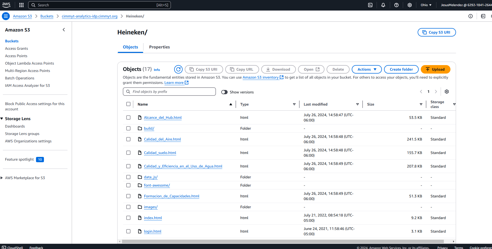

## Intro

The only active case using this version is the **Heineken** dashboard.  

As mentioned in the version section, version 1 is a completely static page.


### Requirements

1. ROP (excel file)
2. Repo dashboard
3. Access AWS S3


### Roadmap


1. Locate the results/indicators according to the dimension (ROP).
2. Clone the repository (link in Excel file).
3. Find results/indicators in the dashboard.
4. Edit HTML, JavaScript, CSV (coordinates), and CSS files (if required).
5. Save changes (version control).
6. Locate the Heineken S3 bucket.
7. Upload to S3 bucket (using GitHub Actions, AWS CLI, or AWS Console).


#### Editing

In the editing process, it is highly recommended to implement version control using the [recommended practices](https://git-scm.com/).

##### Map

For this section, the editing process differs slightly from the other sections.

It involves editing two files:

- /data_js/HP.csv
- /mapa/index.html

For the `csv` file, it is essential to maintain the same structure (column names, data format). This information is obtained from the *resumen bitacoras* query.

On the other hand, the `html` file needs to include the option for the cycle to be reported (this data is stored in the *Ciclo* column). This will add the cycle option to the map's select dropdown.


##### Graphs and UI

The files to edit are primarily:

- HTML
- JavaScript

It is easy to identify the `js` files to edit as they are referenced at the end of the `html` file body and are usually abbreviated, referring to the section name.

The information per cycle is organized as follows:

HTML Structure for Charts:

```
cycle
    ├── pill_deactivate & deactivate_tab
    │    └── container
    │            └── elements(graphs i.e)
    │
    └── pill_activate & active_tab
           └── container
                  └── elements(graphs i.e)
```
Given this structure, it is necessary to create a container and an associated [pill](https://getbootstrap.com/docs/3.4/components/#nav)  cycle.


Structure Content for JavaScript

```
graph_function
    ├── id
        └── data            

```

Thus, by simply copying and pasting, it is possible to add new elements for a new cycle. **Important**: make sure to create new IDs, data, tags and corresponding labels.


#### S3
Once the update process is complete and changes have been stored in the remote repository, it's time to upload the changes to Amazon Web Services cloud.
For versions 1 and 2, the dashboards are stored in a bucket. 

You can enter and automate the upload of information using tools like GitHub Actions or through the AWS SDK.
Similarly, it is possible to access the console with administrator or user credentials (with the corresponding permissions). Once inside the dashboards bucket, identify the Heineken directory. As you will notice, it maintains the same structure as the project repository. Upload the files to be updated in the corresponding path.


```
Amazon s3 >> Buckets >> cimmyt-analytics-idp.cimmyt.org >> Heineken/

```

