## Intro

As of December 2024, we have 7 active dashboards.

| Dashboard Project | Version Type  | 
| ----------------- | ------------- |
| Agriba            | Version 2     | 
| Bimbo             | Version 2     | 
| Heineken          | Version 2     | 
| Kelloggs          | Version 2     | 
| Ingredion         | Version 2     | 
| Mars              | Version 2     | 
| Nestle            | Version 2     | 


### Requirements

1. ROP (excel file)
2. Repo dashboard
3. Access AWS S3


### Roadmap

1. Coordinate Cleaning Process (Jupyter notebook, log CSV)
2. Locate the results/indicators according to the dimension (ROP).
3. Clone the repository (link in Excel file).
4. Find results/indicators in the dashboard.
5. Edit and update JSON and GeoJSON files
6. Locate the project S3 bucket.
7. Upload to S3 bucket (using GitHub Actions, AWS CLI, or AWS Console).

#### Coordinate Cleaning

In this case, it is necessary to perform the cleaning and transformation process into a geographic data type.

To render the map with polygons, the [ArcGIS API](https://developers.arcgis.com/javascript/latest/) requires a service or a file with the structure of a [GeoJSON](https://en.wikipedia.org/wiki/GeoJSON) file

In this case, there is a cleaning/transformation process in Python. Below is the link to the repository that contains a [Jupyter Notebook](https://github.com/JesusMelendez/preprocess_sitios).

#### JSON File Update

Below is the structure of the [JSON](https://www.json.org/json-en.html) files that store the information for the indicators.

```mermaid
graph TD

    main_node{JSON 📰}
    main_node --> header{Header}
    main_node --> kpi_set{KPI SET 💾}
    kpi_set --> indicator{Indicator ⚡}
    indicator --> obs{Observations 👁‍🗨}
    obs --> period{Period 📆}
    period --> results{Results 📗}
    results --> data{Data 📊}
```



JSON Tree 


#### S3 

This step is the same process that the version 1

Once the update process is complete and changes have been stored in the remote repository, it's time to upload the changes to Amazon Web Services cloud.
For versions 1 and 2, the dashboards are stored in a bucket. 

You can enter and automate the upload of information using tools like GitHub Actions or through the AWS SDK.
Similarly, it is possible to access the console with administrator or user credentials (with the corresponding permissions). Once inside the dashboards bucket, identify the Heineken directory. As you will notice, it maintains the same structure as the project repository. Upload the files to be updated in the corresponding path. Please review excel file with this information.

```
Amazon s3 >> Buckets >> cimmyt-analytics-idp.cimmyt.org >> ExampleProjectName/

```


