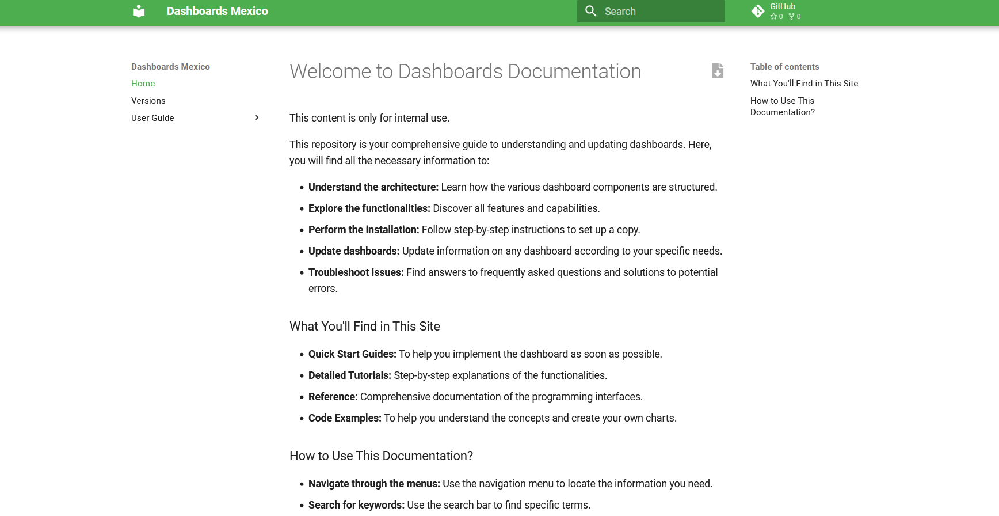
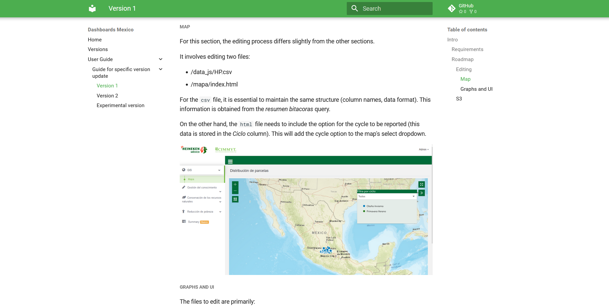

#### Bienvenido a la documentación de tableros




1. Clonar el repo
2. Una vez clonado, crear ambiente virtual

```

py -m venv venv

```
iniciar ambien virtual

Para linux
```
source venv/bin/activate

```

Para windows

```
source venv/Scripts/activate

```
Una vez en el ambiente virtual, instalamos las biblotecas necesarias desde el archivo `requirements.txt`

```
pip install -r requirements.txt

```

Ya con todas las dependencias necesarias. Entramos al directorio   **dashboards**  e iniciamos el servidor local con el siguiente comando.

```
mkdocs serve
```


